# Design

Let's introduce the core design patterns behind **Procs** and **Apps** in **nuRemics**.

## Proc

A **Proc** can be seen as an algorithmic box which processes some input data and produces corresponding output data.

The input data typically fall into two main categories:

- **Input parameters**: Scalar values such as `float`, `int`, `bool`, or `str`.

- **Input paths**: Files or folders provided as `Path` objects (from Python's `pathlib` module), pointing to structured data on disk.

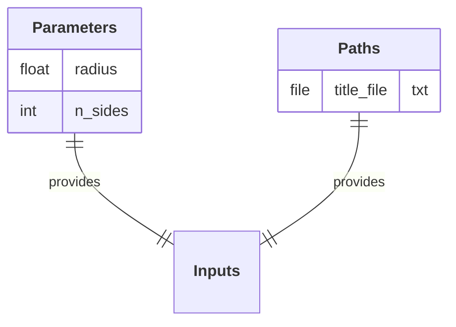

As mentioned in the [Handbook Overview](index.md){:target="_blank"}, the algorithmic box of the **Proc** is a class composed of functions (**Op**) called sequentially within its `__call__` method.

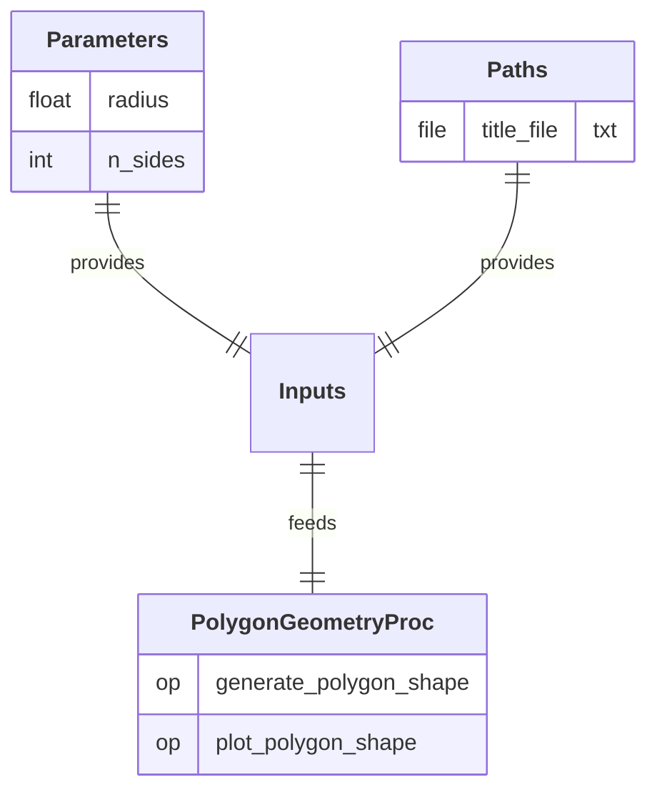

Output data are typically expressed as `Path` objects as well, corresponding to files or folders written to disk during the execution of the **Proc**.

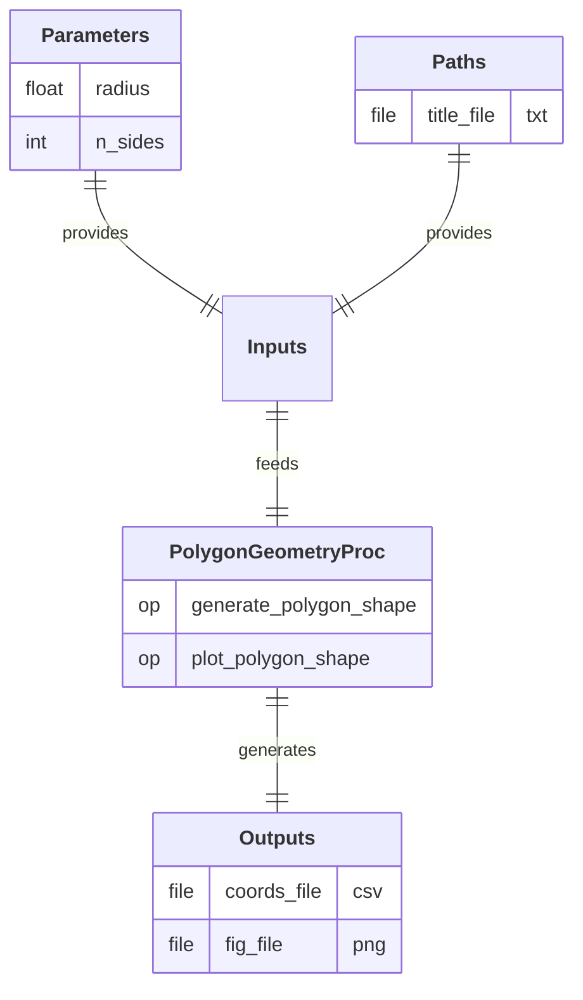

For the sake of example, let's define another **Proc** considering the same structure.

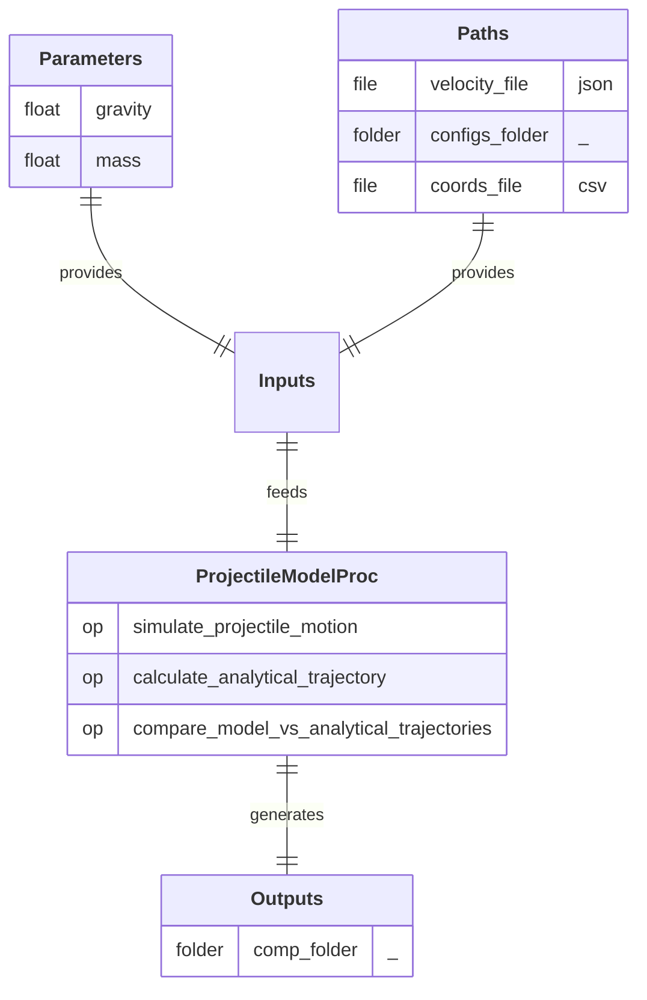

## App

A final end-user **App** can be built by plugging together previously implemented **Procs**, and specifying their sequential order of execution within the workflow.

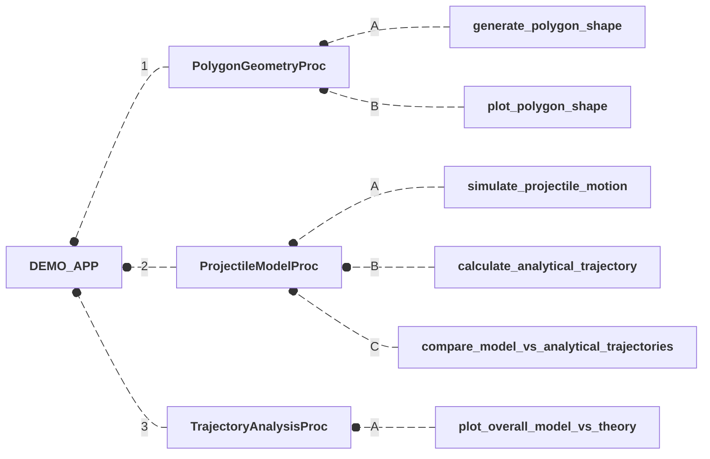

Each **Proc** integrated into the **App** defines its own set of inputs and outputs, specific to its internal algorithmic logic. When these **Procs** are assembled into a workflow, the **App** itself exposes a higher-level set of inputs and outputs. These define the I/O interface presented to the end-user, who provides the necessary input data and retrieves the final results upon execution.

The assembly step is performed through a mapping between the internal I/O data of each **Proc** and the global I/O interface of the **App**. This mapping mechanism serves multiple purposes:

- It defines which data are exposed to the end-user (and how they are displayed) and which remain internal to the workflow.

- It manages the data dependencies between **Procs**, when the output of one **Proc** is used as input for another.

This notably ensures a coherent and seamless management of data across the workflow, while delivering a clean and focused I/O interface tailored to the user's needs.

The mapping between a **Proc** and the **App** starts by specifying which **Proc** input parameters are exposed to the end-user, and how they are labeled in the **App** input interface.

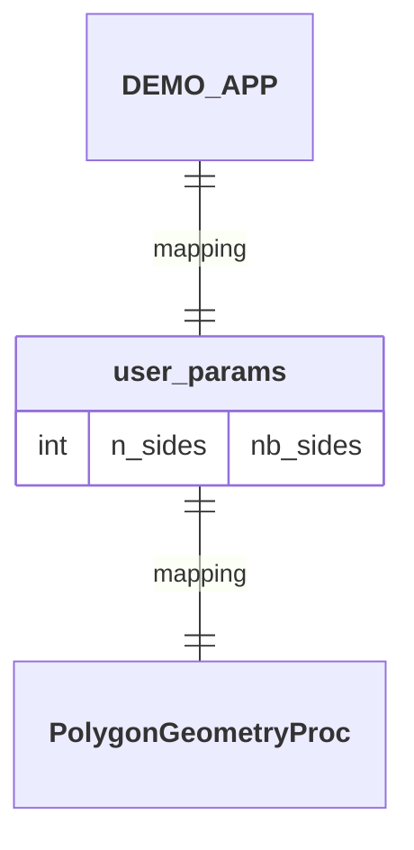

The **Proc** input parameters that remain internal to the workflow are assigned fixed values directly within the mapping definition, without being exposed to the end-user.

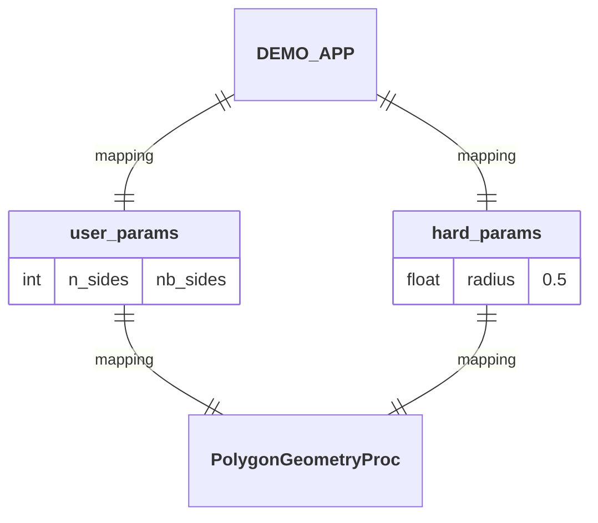

The **Proc** input paths that need to be provided by the end-user are specified by defining the expected file or folder names within the **App** input interface.

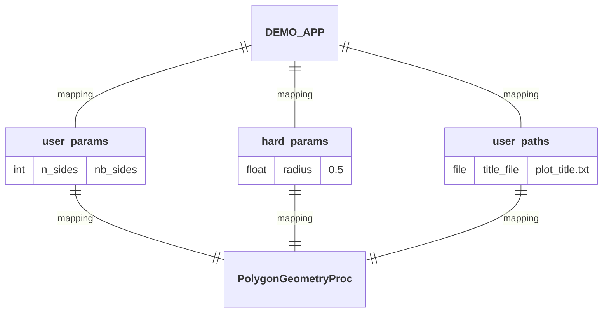

The **Proc** input paths can also be mapped to output paths produced by a previous **Proc** within the workflow (although this does not apply here, as we are currently focusing on the first **Proc** in the workflow).

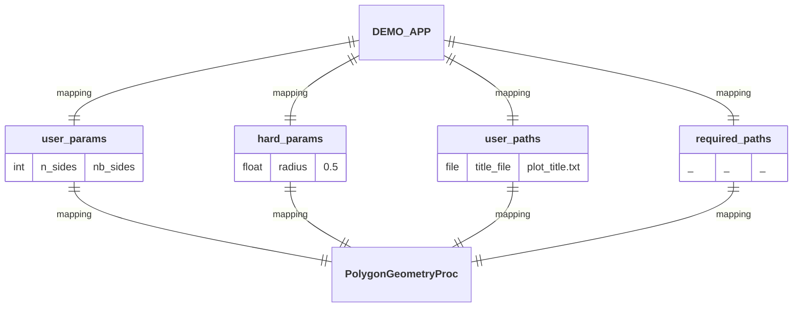

Finally, the **Proc** output paths are specified by indicating the name of the file(s) or folder(s) that will be written by the **Proc** during the workflow execution.

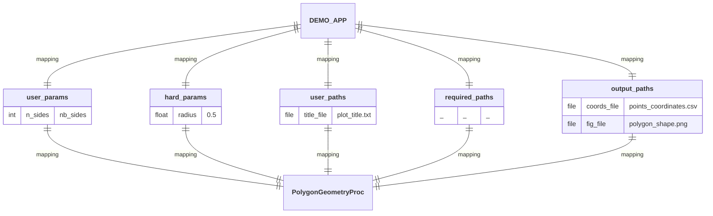

Let's now assemble the second **Proc** to be executed by the **App** within the workflow, by establishing a dependency: the output data produced by the first **Proc** will serve as input data for this second one.

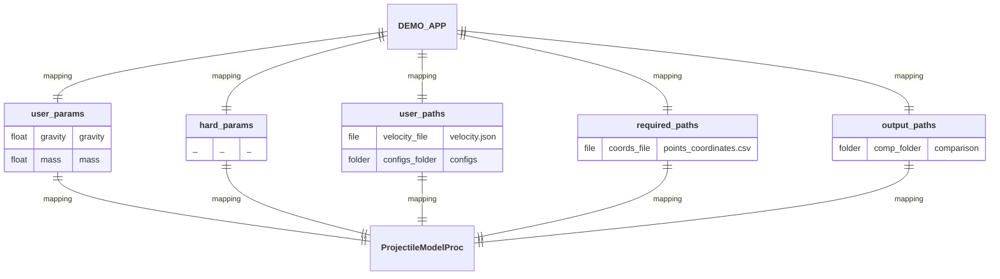

Once all **Procs** have been assembled into the **App**, the final I/O interface presented to the end-user emerges.

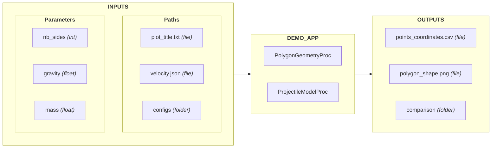

It is also insightful for the end-user to present this I/O interface by showing which **INPUTS** are used by each **Proc** of the **App**, and which **OUTPUTS** are written by each of them.

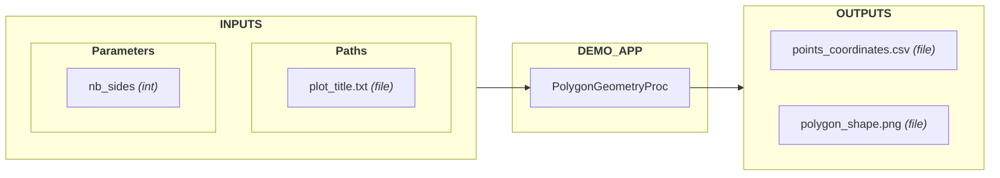

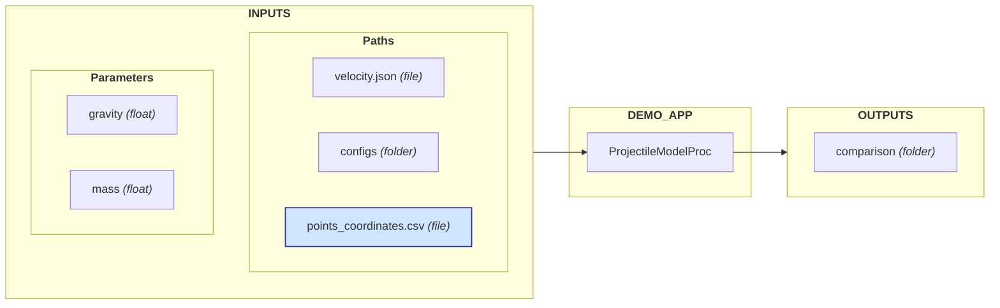

---

  <a href="../usability/" class="md-button md-button--primary">
    Usability
  </a>

---