# Theory

## Design Patterns

Let’s introduce the core design patterns behind **Procs** and **Apps** in **NUREMICS**.

### Proc

A **Proc** can be seen as an algorithmic box which processes some input data and produces corresponding output data.

The input data typically fall into two main categories:

- **Input parameters**: Scalar values such as `float`, `int`, `bool`, or `str`.

- **Input paths**: Files or folders provided as `Path` objects (from Python's `pathlib` module), pointing to structured data on disk.

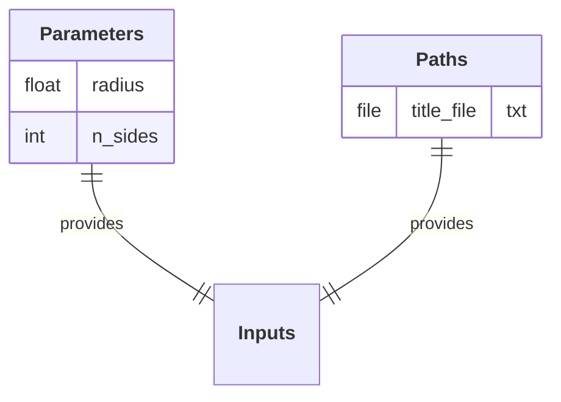

As mentioned in the [Handbook Overview](index.md){:target="_blank"}, the algorithmic box of the **Proc** is a class composed of functions (**Op**) called sequentially within its `__call__` method.

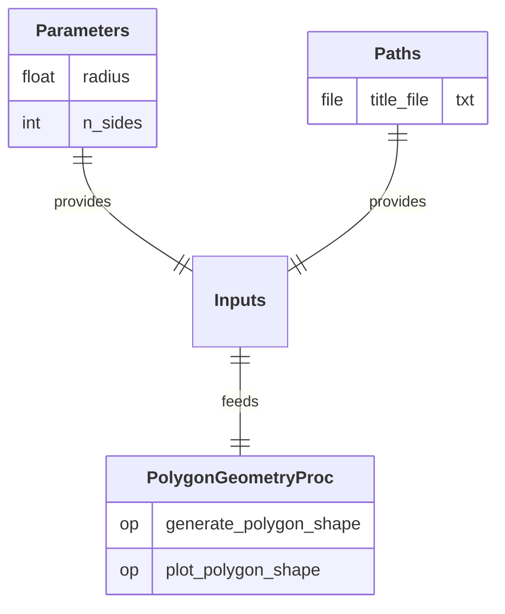

Output data are typically expressed as `Path` objects as well, corresponding to files or folders written to disk during the execution of the **Proc**.

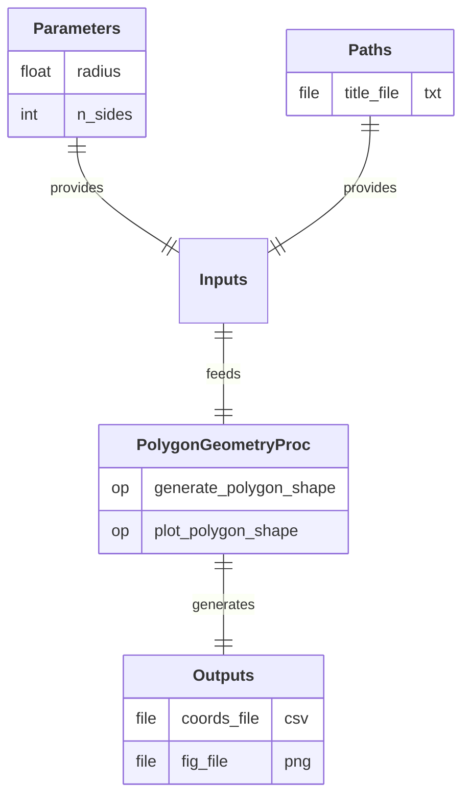

For the sake of example, let's define another **Proc** considering the same structure.

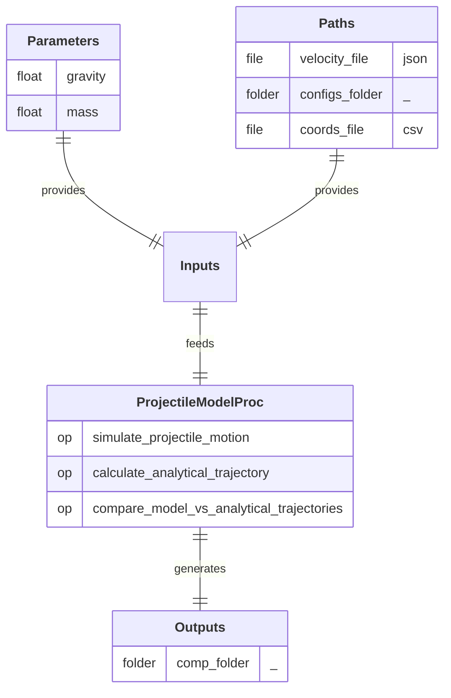

### App

A final end-user **App** can be built by plugging together previously implemented **Procs**, and specifying their sequential order of execution within the workflow.

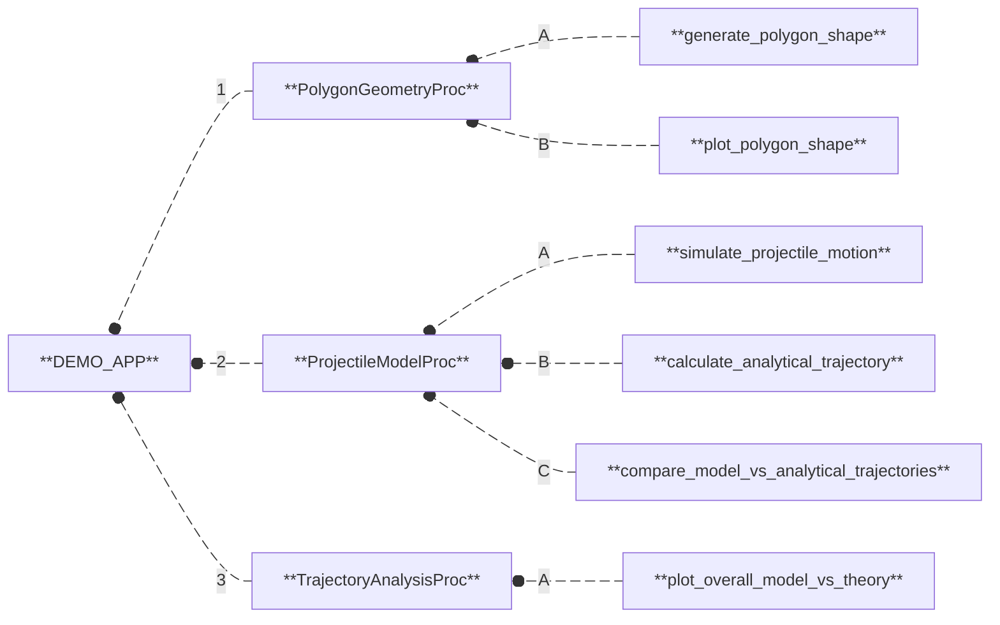

Each **Proc** integrated into the **App** defines its own set of inputs and outputs, specific to its internal algorithmic logic. When these **Procs** are assembled into a workflow, the **App** itself exposes a higher-level set of inputs and outputs. These define the I/O interface presented to the end-user, who provides the necessary input data and retrieves the final results upon execution.

The assembly step is performed through a mapping between the internal I/O data of each **Proc** and the global I/O interface of the **App**. This mapping mechanism serves multiple purposes:

- It defines which data are exposed to the end-user (and how they are displayed) and which remain internal to the workflow.

- It manages the data dependencies between **Procs**, when the output of one **Proc** is used as input for another.

This notably ensures a coherent and seamless management of data across the workflow, while delivering a clean and focused I/O interface tailored to the user's needs.

The mapping between a **Proc** and the **App** starts by specifying which **Proc** input parameters are exposed to the end-user, and how they are labeled in the **App** input interface.

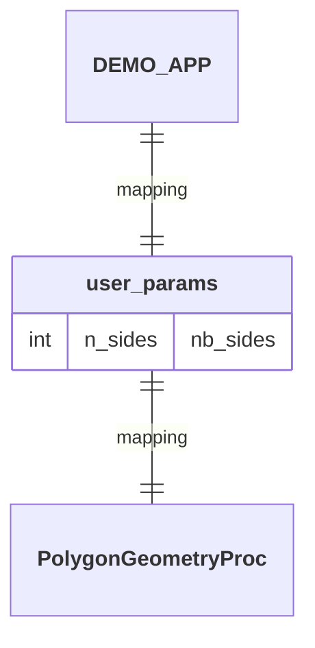

The **Proc** input parameters that remain internal to the workflow are assigned fixed values directly within the mapping definition, without being exposed to the end-user.

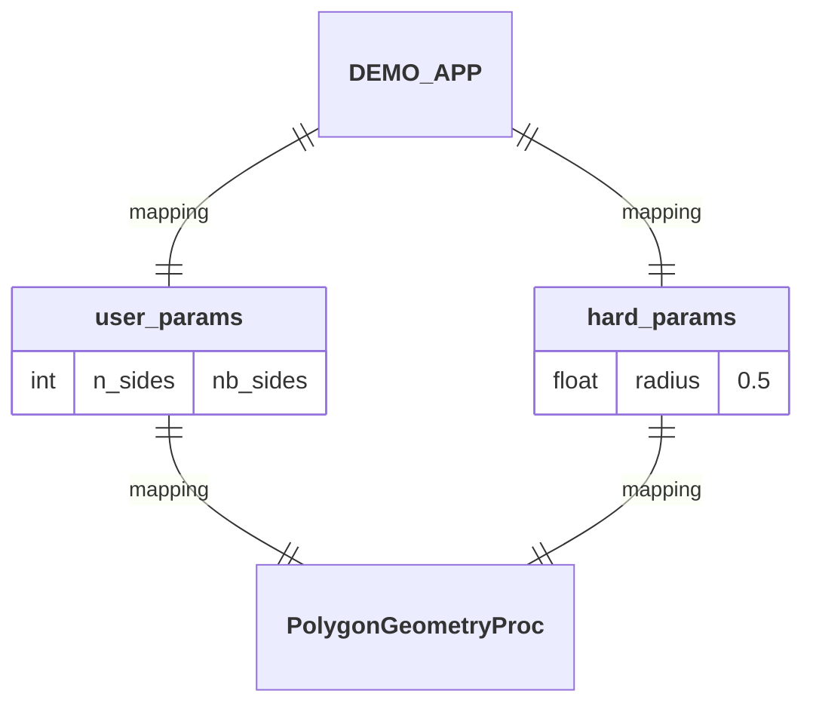

The **Proc** input paths that need to be provided by the end-user are specified by defining the expected file or folder names within the **App** input interface.

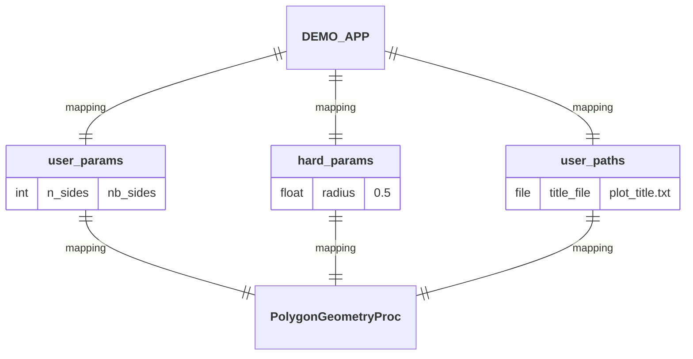

The **Proc** input paths can also be mapped to output paths produced by a previous **Proc** within the workflow (although this does not apply here, as we are currently focusing on the first **Proc** in the workflow).

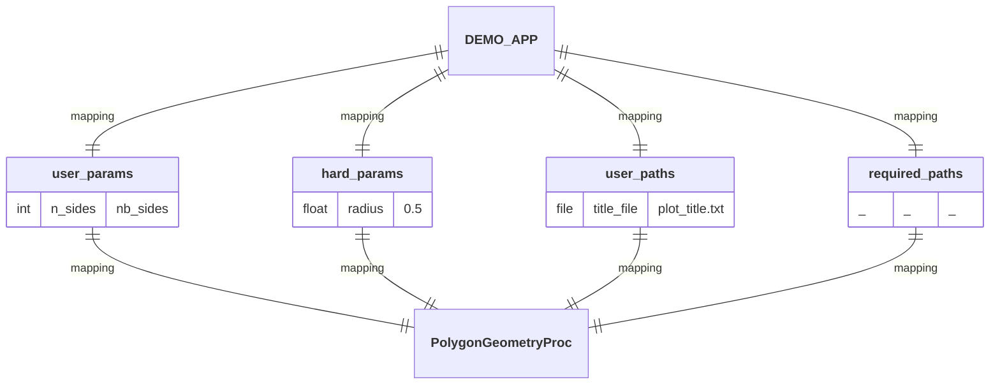

Finally, the **Proc** output paths are specified by indicating the name of the file(s) or folder(s) that will be written by the **Proc** during the workflow execution.

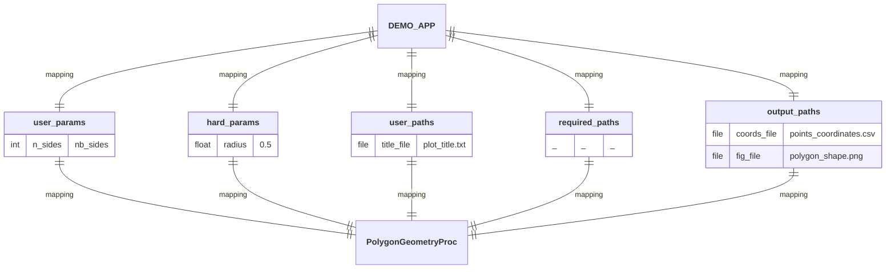

Let's now assemble the second **Proc** to be executed by the **App** within the workflow, by establishing a dependency: the output data produced by the first **Proc** will serve as input data for this second one.

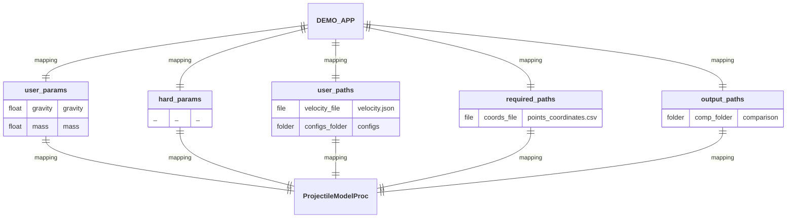

Once all **Procs** have been assembled into the **App**, the final I/O interface presented to the end-user emerges.

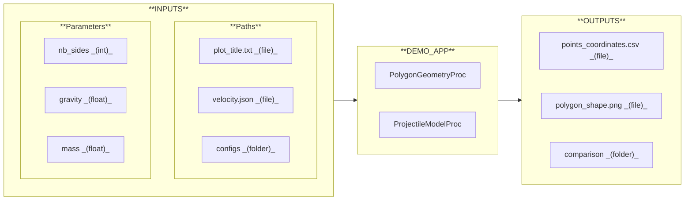

It is also insightful for the end-user to present this I/O interface by showing which **INPUTS** are used by each **Proc** of the **App**, and which **OUTPUTS** are written by each of them.

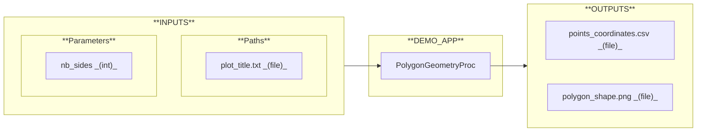

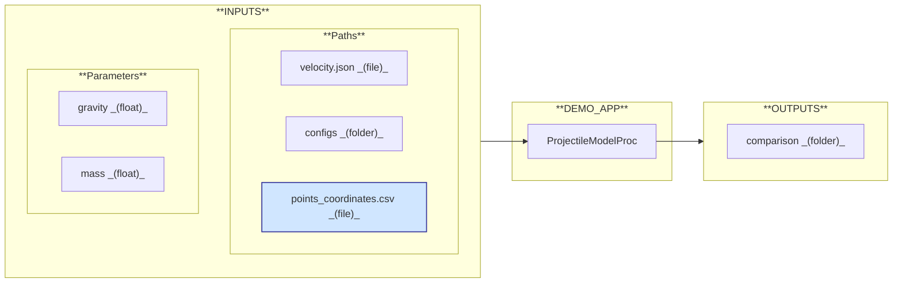

## Usability

The **Apps** built with **NUREMICS** come with a lean and pragmatic user interface by design. No flashy GUI, but instead, the focus is on simplicity and efficiency:

- An input database that the operator completes by editing configuration files and uploading the required input files and folders.

- A terminal interface that provides informative feedback at each execution, clearly indicating what the **App** is doing and what actions are expected from the operator.

- An output database that stores all results in a well-structured and traceable folder hierarchy.

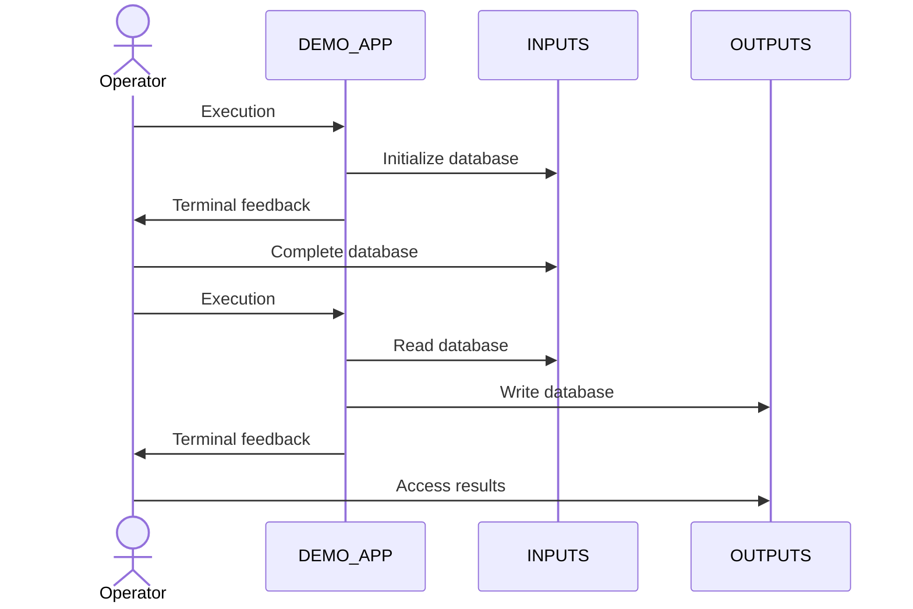

This streamlined approach prioritizes clarity, control, and reproducibility, making each **App** built with **NUREMICS** well-suited for both direct interaction by end-users and seamless integration into larger software ecosystems. In such environments, **NUREMICS** can operate as a backend computational engine, interacting programmatically with other tools (such as web applications) that provide their own user interfaces.

### Configuration

When running an **App**, the operator first defines a set of studies aimed at exploring the **INPUTS** space and analyzing the outcomes in the **OUTPUTS** space.

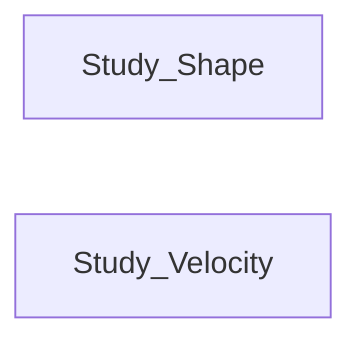

The operator then configures each study by selecting which inputs stay constant _(Fixed)_ and which ones change _(Variable)_ across the various experiments.

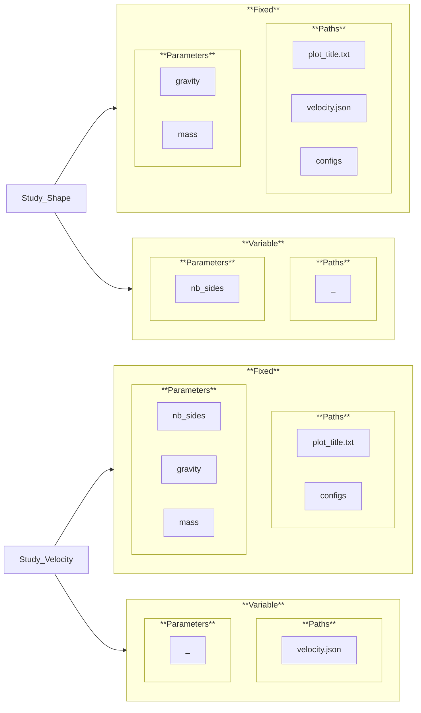

### Settings

To conduct experiments, the operator assigns values for both fixed and variable inputs: fixed inputs remain constant across all experiments _(Common)_, while variable inputs are adjusted from one experiment to another _(Test1, Test2, ...)_.

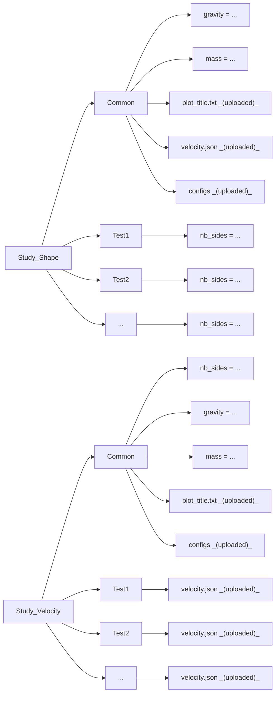

### Results

At the end of the execution, results are stored in a structured output tree, ready for review or further processing. The outputs are first organized by **Proc**, each of them writing its own result data. Within each **Proc**, the results are further subdivided by experiment _(Test1, Test2, ...)_, ensuring a clear separation and traceability of outcomes across the entire study.

This organization is automatically determined based on how the study is configured by the operator. **NUREMICS** analyzes which input data are marked as _fixed_ or _variable_, and how they connect to the internal workflow of the **App**. If a **Proc** directly depends on _variable_ inputs, or indirectly through upstream dependencies, it will generate distinct outputs for each experiment. Otherwise, it will produce shared outputs only once.

This logic ensures that only the necessary parts of the workflow are repeated through experimentations, and that the output structure faithfully reflects the configuration of the study along with the internal dependencies within the workflow.

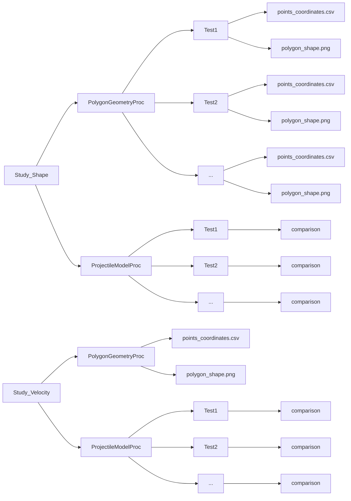

---

Explore NUREMICS in:

  <a href="../practice/" class="md-button md-button--primary">
    Practice
  </a>

---