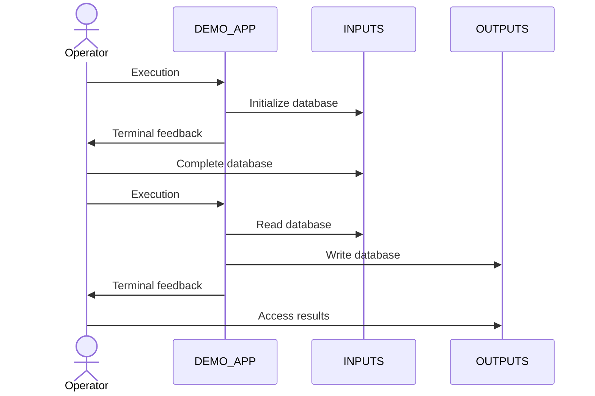
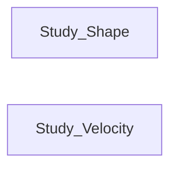
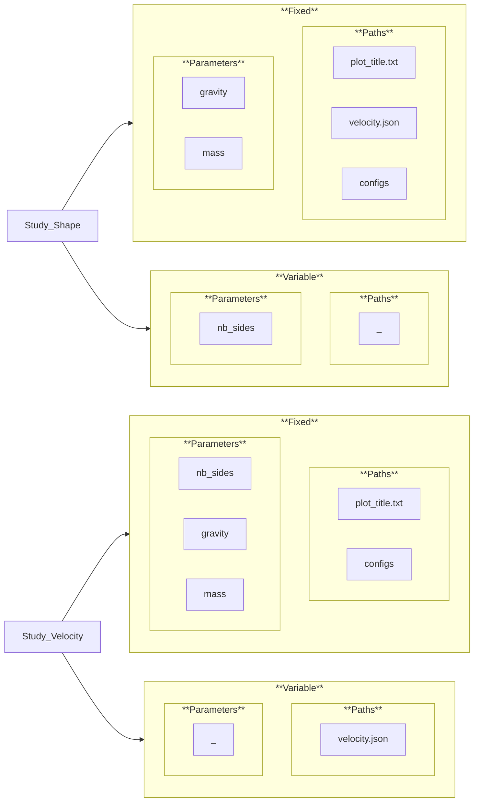
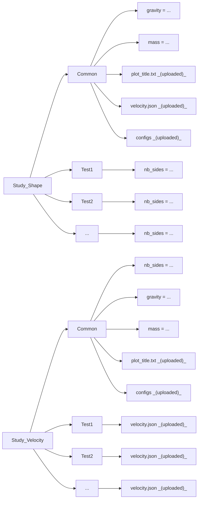
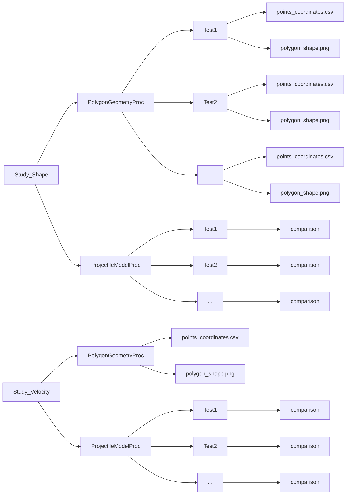

# Usability

The **Apps** built with **nuRemics** come with a lean and pragmatic user interface by design. No flashy GUI, but instead, the focus is on simplicity and efficiency:

- An input database that the operator completes by editing configuration files and uploading the required input files and folders.

- A terminal interface that provides informative feedback at each execution, clearly indicating what the **App** is doing and what actions are expected from the operator.

- An output database that stores all results in a well-structured and traceable folder hierarchy.

This streamlined approach prioritizes clarity, control, and reproducibility, making each **App** built with **nuRemics** well-suited for both direct interaction by end-users and seamless integration into larger software ecosystems. In such environments, **nuRemics** can operate as a backend computational engine, interacting programmatically with other tools (such as web applications) that provide their own user interfaces.

## Configuration

When running an **App**, the operator first defines a set of studies aimed at exploring the **INPUTS** space and analyzing the outcomes in the **OUTPUTS** space.

The operator then configures each study by selecting which inputs stay constant _(Fixed)_ and which ones change _(Variable)_ across the various experiments.

To conduct experiments, the operator assigns values for both fixed and variable inputs: fixed inputs remain constant across all experiments _(Common)_, while variable inputs are adjusted from one experiment to another _(Test1, Test2, ...)_.

## Results

At the end of the execution, results are stored in a structured output tree, ready for review or further processing. The outputs are first organized by **Proc**, each of them writing its own result data. Within each **Proc**, the results are further subdivided by experiment _(Test1, Test2, ...)_, ensuring a clear separation and traceability of outcomes across the entire study.

This organization is automatically determined based on how the study is configured by the operator. **nuRemics** analyzes which input data are marked as _fixed_ or _variable_, and how they connect to the internal workflow of the **App**. If a **Proc** directly depends on _variable_ inputs, or indirectly through upstream dependencies, it will generate distinct outputs for each experiment. Otherwise, it will produce shared outputs only once.

This logic ensures that only the necessary parts of the workflow are repeated through experimentations, and that the output structure faithfully reflects the configuration of the study along with the internal dependencies within the workflow.

---

  <a href="../design/" class="md-button md-button--primary">
    Design
  </a>

---