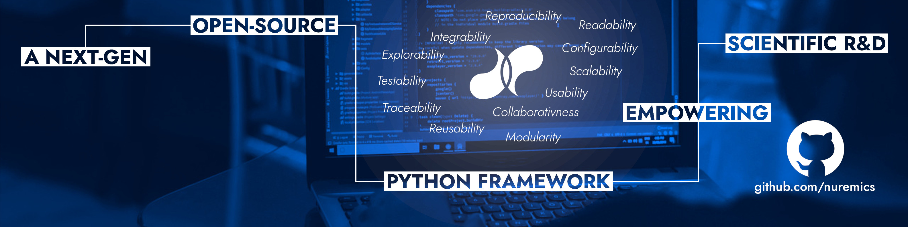

#

  
  
  
  
  
  
  

**nuRemics is an open-source Python framework for building software-grade scientific tools.**

🔬 Scientific agility — engineering rigor. 
🧩 Modular by design — no more siloed tools. 
📊 Parametric exploration — iterate without limits. 
📋 Full traceability — every experiment accounted for. 
📈 Built to scale — from lab to industry.  
🌐 Community-driven — innovation thrives together.

---

  <iframe width="640" height="360"
          src="https://www.youtube.com/embed/GbbZldfJHy0?autoplay=1&loop=1&playlist=GbbZldfJHy0&mute=1"
          frameborder="0"
          allow="autoplay"
          allowfullscreen>
  </iframe>

  <a href="getting-started/"
    class="md-button md-button--primary">
    Getting Started
  </a>
  <a href="https://www.suffisciens.com/labsvision"
     target="_blank"
     rel="noopener noreferrer"
     class="md-button md-button--primary">
    Onboarding
  </a>
  <a href="use-cases/"
    class="md-button md-button--primary">
    Use Cases
  </a>

---

## Overview

The **nuRemics** framework provides a dedicated environment to build custom software tools designed for the automated production of scientific results at scale, ensuring systematic reproducibility and full traceability across every execution. This is achieved through a clear separation of concerns, organized into the following layered structure:
  

    

**APP**

It is the execution engine where the core scientific logic is formalized and implemented in a codebase. It operates as a structured workflow composed of autonomous software processes (e.g., Process1-3) executed in a sequential order. Each software process encapsulates a specific stage of the computation and acts as an independent functional item.

**INPUTS**

It defines the entry points required by the application to function (e.g., Input1–6) and ensures that each input is routed to its respective software process, in order to satisfy the corresponding data requirements.

**OUTPUTS**

It defines the delivery points where results are produced during execution (e.g., Output1–4). Each software process generates its own outputs, which are either stored as final results or re-routed as inputs of subsequent software processes within the workflow.

**CONFIGURATION**

It orchestrates how the application is controlled by the operator across different study scenarios (e.g., Study1–2). For each study, the operator defines which inputs are _Fixed_ (constant throughout the study) and which are _Variable_ (changing between individual test). This enables automated batch execution of multiple tests (e.g., Test1–3) by systematically updating the inputs.

**TRACEABILITY**

It automatically generates a structured directory tree (Study > Process > Test) where each output is stored within a hierarchy that directly links it back to the specific configuration that produced it. This provides a permanent, auditable record of every production run.

---

## Meet Our Ambassadors

  <a href="ambassadors/Irina_RAKOTOARISEDY" class="ambassador-card"
     target="_blank"
     rel="noopener noreferrer">
    
    
Irina RAKOTOARISEDY

    
PhD student in Deep Learning

    
University Carlos III of Madrid

  </a>

