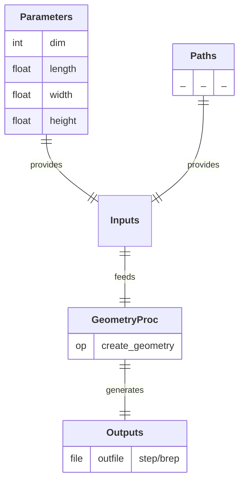

  

## Process

Create a geometric representation of a physical system. 
A/ **`create_geometry`:** Create and export a simple geometric entity (beam, plate, or block) in STEP or BREP format.

## Input Parameter(s)

- **`dim`:** Dimension of the geometry: 1 for a line (beam), 2 for a rectangle (plate), 3 for a box (block).
- **`length`:** Length of the geometry along the X axis.
- **`width`:** Width of the geometry along the Y axis (only used if dim = 2|3).
- **`height`:** Height of the geometry along the Z axis (only used if dim = 3).

## Output Path(s)

- **`outfile`:** File containing the created geometry (in .step if `dim` = 3|2 or .brep if `dim` = 1).

---

  <a href="https://github.com/nuremics/nuremics-labs/tree/cantilever-shear/src/labs/apps/cms/CANTILEVER_SHEAR_APP/procs/GeometryProc"
     target="_blank"
     rel="noopener noreferrer"
     class="md-button md-button--primary">
    View source code
  </a>

---