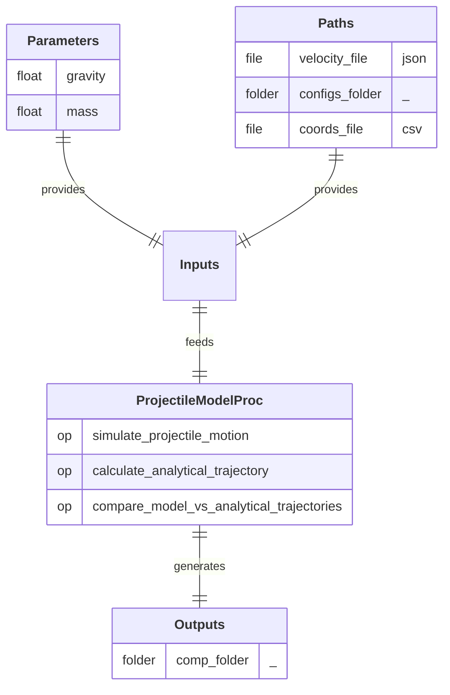

## Process

Simulate a projectile trajectory and compare it with the analytical solution. 
A/ **`simulate_projectile_motion`:** Run the physical simulation of a projectile. 
B/ **`calculate_analytical_trajectory`:** Compute the theoretical trajectory using analytical equations. 
C/ **`compare_model_vs_analytical_trajectories`:** Plot and save the comparison between simulated (model) and theoretical trajectories.

## Input Parameter(s)

- **`gravity`:** Acceleration due to gravity (can be positive or negative).
- **`mass`:** Mass of the projectile (used in the simulation).

## Input Path(s)

- **`velocity_file`:** File containing the velocity initial conditions (v0, angle).
- **`configs_folder/`** 
  **`solver_config.json`:** File containing the parameters for solver configuration. 
  **`display_config.json`:** File containing the parameters for display configuration.
- **`coords_file`:** File containing the X/Y coordinates of the polygonal shape to simulate.

## Output Path(s)

- **`comp_folder/`** 
  **`results.xlsx`:** File containing simulated (model) and theoritical trajectories. 
  **`model_vs_theory.png`:** Image comparing both trajectories.

---

  <a href="" class="md-button md-button--primary">
    View source code
  </a>

