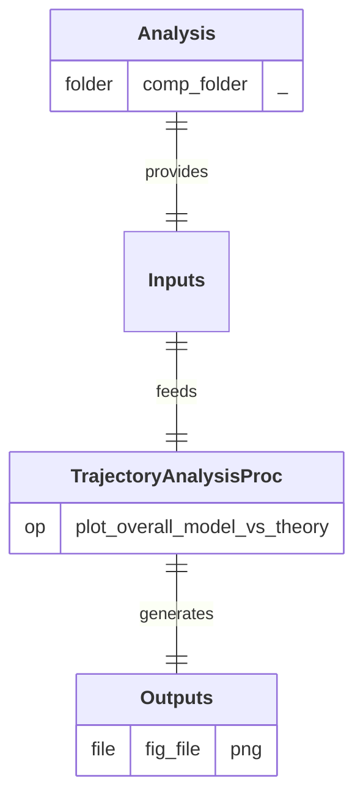

## Process

Compare simulated (model) and theoretical trajectories of a projectile across all experiments. 
A/ **`plot_overall_model_vs_theory`:** Generate overall comparative plot of simulated (model) and theoritical trajectories.

## Input Analysis

- **`comp_folder/`** 
  **`results.xlsx`:** File containing simulated (model) and theoritical trajectories.

## Output Path(s)

- **`fig_file`:** Image comparing both trajectories across all experiments.

---

  <a href="" class="md-button md-button--primary">
    View source code
  </a>

