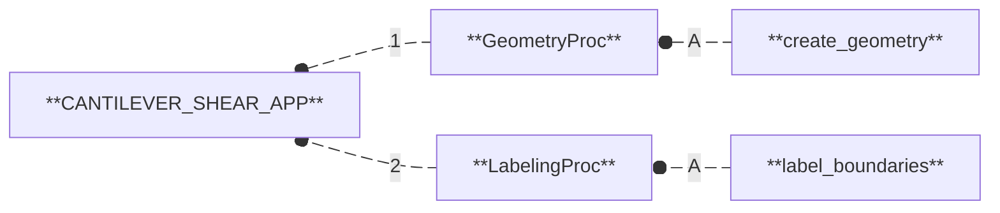

# Cantilever subjected to end shear force

- Branch: [**`cantilever-shear`**](https://github.com/nuremics/nuremics-labs/tree/cantilever-shear){:target="_blank"}
- App: [**`CANTILEVER_SHEAR_APP`**](../../labs/apps/cms/CANTILEVER_SHEAR_APP/app.md){:target="_blank"}

---

Take part of the discussions on the Discord channel <code>#cantilever-shear</code>

  <a href="https://www.suffisciens.com/labsvision"
     target="_blank"
     rel="noopener noreferrer"
     class="md-button md-button--primary">
    Start Your Onboarding
  </a>

---

## Introduction

The present use case addresses a classical benchmark problem in **Computational Structural Mechanics (CSM)**, namely the simulation of a beam structure fixed at one end and loaded by a shear force at the other end (see Fig. 1). This type of problem is widely used in the literature as a reference for evaluating the accuracy and robustness of numerical methods in **CSM**.

The benchmark considered here was originally reported by [Sze *et al.* 2004](https://doi.org/10.1016/j.finel.2003.11.001){:target="_blank"}, who compiled a comprehensive set of non-linear test cases for shell **Finite-Element (FE)** analysis. In their work, the reference solution (summarized in Tab. 1) for this specific problem was obtained using the commercial **FE** solver [*Abaqus*](https://www.3ds.com/products/simulia/abaqus){:target="_blank"}, relying on the S4R four-node shell elements with reduced integration and hourglass control.

<figure class="wide-caption">
  
  <figcaption>Figure 1 (extracted from 
    <a href="https://doi.org/10.1016/j.finel.2003.11.001" target="_blank">Sze et al. 2004</a>):
    (a) Cantilever subjected to end shear force. (b) Load–deflection curves for cantilever subjected to end shear force. (c) The deformed 16 × 1 mesh under the maximum force.
  </figcaption>
</figure>

<figure class="wide-caption">
  
  <figcaption>Table 1 (extracted from 
    <a href="https://doi.org/10.1016/j.finel.2003.11.001" target="_blank">Sze et al. 2004</a>):
    Horizontal and vertical tip deflections for the cantilever loaded with end shear force.
  </figcaption>
</figure>

This test case is particularly interesting because it exhibits non-linear elastic behavior, which provides a meaningful challenge for numerical methods. Additionally, the simple geometric shape of the structure allows for different modeling approaches: fully resolved 3D solid elements, 2D shell elements, or simplified 1D beam elements. Each approach introduces different levels of approximation and computational cost, offering a clear perspective on the trade-offs inherent in structural modeling.

The main objective of this use case is therefore to simulate the benchmark problem using three different modeling strategies [3D solid elements | 2D shell elements | 1D beam elements] within the **nuRemics** framework, and to compare their respective capabilities in capturing the non-linear response of the structure.

<figure class="wide-caption">
  
  <figcaption>Figure 2:
    The ASME V&V40 Standard provides structured guidance for assessing credibility and applicability of Computational Modeling & Simulation in the context of Medical Devices. For more information, see the <a href="https://www.asme.org/codes-standards/find-codes-standards/assessing-credibility-of-computational-modeling-through-verification-and-validation-application-to-medical-devices" target="_blank">official ASME V&V40 page</a>.
  </figcaption>
</figure>

Importantly, this study is performed in application of the **ASME V&V40 standard (V&V40)** (see Fig. 2), which provides guidance for the development of **Computational Modeling & Simulation (CM&S)** technologies, ensuring their credibility and reliability through rigorous **Verification & Validation (V&V)** activities. The standard establishes a structured framework to guarantee that CM&S methods meet the highest standards of safety and effectiveness, particularly in the context of **Medical Device (MD)** development. By adhering to the **V&V40**, this use case not only serves as a benchmark for numerical accuracy but also demonstrates how **nuRemics** can be applied within a scientifically rigorous and regulatory-aware workflow.

It is nonetheless important to note that this methodology could be broadened to contexts beyond **MD**, making the **V&V40** framework relevant for a wide range of industrial applications where the **V&V** of computational models is critical for design, safety, and performance assessment.

In the present use case, the benchmark problem is employed to establish the credibility factor associated with **Numerical Code Verification (NCV)**. The objective of **NCV** is to demonstrate the correct implementation and functioning of the numerical algorithms within the **CM&S** framework. This involves a careful investigation of key numerical aspects, including spatial and temporal convergence rates, independence from coordinate transformations, and symmetry tests under various system conditions.

**NCV** is typically conducted by comparing numerical solutions to exact benchmark solutions, which may be analytical or semi-analytical, or generated using techniques such as the methods of manufactured solutions. In this use case, the cantilever beam benchmark provides such a reference solution, enabling a rigorous assessment of the numerical fidelity of the **nuRemics CM&S software system** across multiple modeling strategies (3D solids, 2D shells, and 1D beams).

## Materials & Methods

This use case is organized into a sequential scientific workflow, implemented through a **nuRemics App** called **[`CANTILEVER_SHEAR_APP`](../../labs/apps/cms/CANTILEVER_SHEAR_APP/app.md){:target="_blank"}**.

### Workflow

The workflow is composed of the following software processes:

1. **[`GeometryProc`](../../labs/apps/cms/CANTILEVER_SHEAR_APP/procs/GeometryProc.md){:target="_blank"}:** Create a geometric representation of a physical system. 
  A/ **`create_geometry`:** Create and export a simple geometric entity (beam, plate, or block) in STEP or BREP format.
2. **[`LabelingProc`](../../labs/apps/cms/CANTILEVER_SHEAR_APP/procs/LabelingProc.md){:target="_blank"}:** Define and label the entities of a physical system from its geometric representation. 
  A/ **`label_boundaries`:** Assign labels to the boundaries of a geometric model.

### I/O Interface

The following I/O interface describes the input data required and the output data generated by the workflow:

#### INPUTS

The input data are divided into two categories: **Parameters** and **Paths**.

##### Parameters

These are scalar values that must be defined to configure the workflow:

- **`dimension`:** Dimension of the geometry: 1 for a line (beam), 2 for a rectangle (plate), 3 for a box (block).

##### Paths

These are either files or folders that must be provided to configure the workflow:

**`N/A`**

#### OUTPUTS

The output data are either files or folders generated by the workflow and written to disk:

- **`geometry.(step/brep)`:** File containing the geometric model (in .step if `dim` = 3|2 or .brep if `dim` = 1).
- **`boundaries.json`:** File containing the labeled geometric entities.

## Results

The following studies were carried out:

### Study_Dim

This study has been configured as follows:

#### GeometryProc

##### Test1

<figure class="wide-caption">
  
  <figcaption>Test</figcaption>
</figure>

##### Test2

<figure class="wide-caption">
  
  <figcaption>Test</figcaption>
</figure>

##### Test3

<figure class="wide-caption">
  
  <figcaption>Test</figcaption>
</figure>

  <!-- Ligne avec 3 sous-figures -->
  

    
    <!-- <figcaption>(Test1) <code>dimension</code> = 3 (3D block). </figcaption> -->
    <figcaption>Test1</figcaption>
  

  

    
    <!-- <figcaption>(Test2) <code>dimension</code> = 2 (2D plate). </figcaption> -->
    <figcaption>Test2</figcaption>
  

  

    
    <!-- <figcaption>(Test3) <code>dimension</code> = 1 (1D beam). </figcaption> -->
    <figcaption>Test3</figcaption>
  

  <!-- Légende globale -->
  <figcaption style="margin-top:10px; font-style:italic;">
    Figure 3: Created geometry of the physical system.
  </figcaption>
</figure>

---

  <a href="../../../labs/apps/cms/CANTILEVER_SHEAR_APP/app/"
     target="_blank"
     rel="noopener noreferrer"
     class="md-button md-button--primary">
    View App
  </a>

---