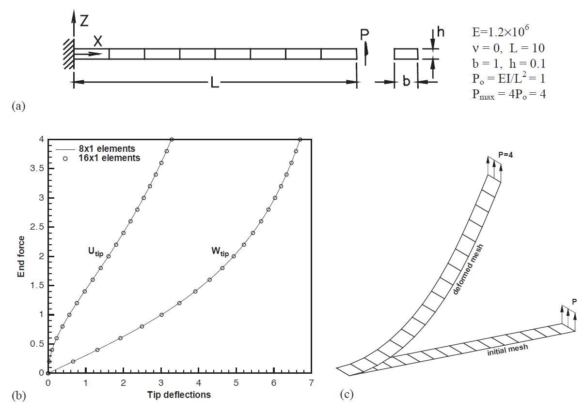

# Cantilever subjected to end shear force

- Branch: [**`cantilever-shear`**](https://github.com/nuremics/nuremics-labs/tree/cantilever-shear){:target="_blank"}
- App: [**`CANTILEVER_SHEAR_APP`**](../../../labs/apps/cms/CANTILEVER_SHEAR_APP/app.md){:target="_blank"}

---

  

  <a href="introduction/"
     class="md-button md-button--primary">
    Introduction
  </a>
  <a href="materials-and-methods/"
     class="md-button md-button--primary">
    Materials & Methods
  </a>
  <a href="results/"
     class="md-button md-button--primary">
    Results
  </a>

---