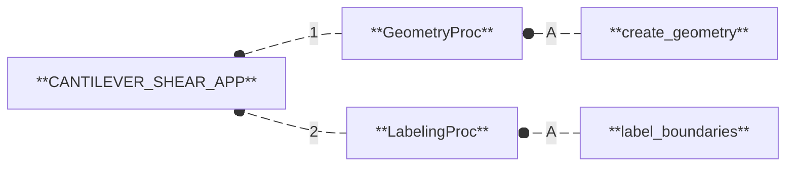

# Materials & Methods

This use case is organized into a sequential scientific workflow, implemented through a **nuRemics App** called **[`CANTILEVER_SHEAR_APP`](../../../labs/apps/cms/CANTILEVER_SHEAR_APP/app.md){:target="_blank"}**.

## Workflow

The workflow is composed of the following software processes:

1. **[`GeometryProc`](../../../labs/apps/cms/CANTILEVER_SHEAR_APP/procs/GeometryProc.md){:target="_blank"}:** Create a geometric representation of a physical system. 
  A/ **`create_geometry`:** Create and export a simple geometric entity (beam, plate, or block) in STEP or BREP format.
2. **[`LabelingProc`](../../../labs/apps/cms/CANTILEVER_SHEAR_APP/procs/LabelingProc.md){:target="_blank"}:** Define and label the entities of a physical system from its geometric representation. 
  A/ **`label_boundaries`:** Assign labels to the boundaries of a geometric model.

## I/O Interface

The following I/O interface describes the input data required and the output data generated by the workflow:

The **[`GeometryProc`](../../../labs/apps/cms/CANTILEVER_SHEAR_APP/procs/GeometryProc.md){:target="_blank"}** software process handles the following input and output data:

The **[`LabelingProc`](../../../labs/apps/cms/CANTILEVER_SHEAR_APP/procs/LabelingProc.md){:target="_blank"}** software process handles the following input and output data:

### Inputs

The input data are divided into two categories: **Parameters** and **Paths**.

#### Parameters

These are scalar values that must be defined to configure the workflow:

- **`dimension`:** Dimension of the geometry: 1 for a line (beam), 2 for a rectangle (plate), 3 for a box (block).

#### Paths

These are either files or folders that must be provided to configure the workflow:

**`N/A`**

### Outputs

The output data are either files or folders generated by the workflow and written to disk:

- **`geometry.(step/brep)`:** File containing the geometric model (in .step if `dim` = 3|2 or .brep if `dim` = 1).
- **`boundaries.json`:** File containing the labeled geometric entities.

---

  <a href="../results/"
     class="md-button md-button--primary">
    Results
  </a>

---