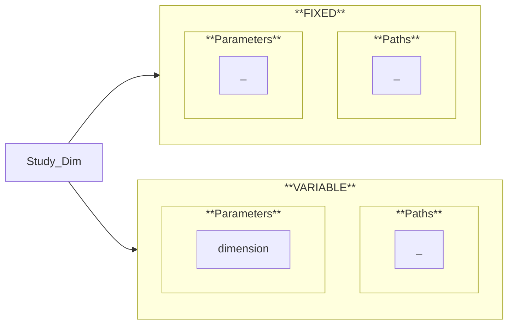

# Study_Dim

This study has been configured as follows:

## Inputs

The input data considered for the present study are summarized below.

### Fixed

These input data remain constant across all experiments and are thus shared by every execution of the workflow.

#### Parameters

N/A

#### Paths

N/A

### Variable

These input data vary between experiments, defining multiple test configurations to be evaluated by the workflow.

#### Parameters

<!-- 
 -->
  <table style="border-collapse: collapse; text-align: center; font-family: Jost; font-size: 14px; margin: 0px;">
    <thead style="background-color: #007eff; color: white;">
      <tr>
        <th>ID</th>
        <th style="text-align: center;">dimension</th>
      </tr>
    </thead>
    <tbody>
      <tr style="background-color: #f9f9f9; transition: background 0.3s;" onmouseover="this.style.backgroundColor='#ddd';" onmouseout="this.style.backgroundColor='#f9f9f9';">
        <td><strong>Test1</strong></td>
        <td style="text-align: center;">3</td>
      </tr>
      <tr style="background-color: #fff; transition: background 0.3s;" onmouseover="this.style.backgroundColor='#ddd';" onmouseout="this.style.backgroundColor='#fff';">
        <td><strong>Test2</strong></td>
        <td style="text-align: center;">2</td>
      </tr>
      <tr style="background-color: #f9f9f9; transition: background 0.3s;" onmouseover="this.style.backgroundColor='#ddd';" onmouseout="this.style.backgroundColor='#f9f9f9';">
        <td><strong>Test3</strong></td>
        <td style="text-align: center;">1</td>
      </tr>
    </tbody>
  </table>

#### Paths

N/A

## GeometryProc

The output data generated by the present software process are summarized below:

- **`geometry.(step/brep)`**

### Test1

  <iframe width="800" height="474.17"
          src="https://www.youtube.com/embed/77YxfjQWO2E?autoplay=1&loop=1&playlist=77YxfjQWO2E&mute=1"
          frameborder="0"
          allow="autoplay"
          allowfullscreen>
  </iframe>
  

    Display of the <strong><code>geometry.step</code></strong> file.
  

### Test2

  <iframe width="800" height="474.17"
          src="https://www.youtube.com/embed/nRskDmz1mR0?autoplay=1&loop=1&playlist=nRskDmz1mR0&mute=1"
          frameborder="0"
          allow="autoplay"
          allowfullscreen>
  </iframe>
  

    Display of the <strong><code>geometry.step</code></strong> file.
  

### Test3

  <iframe width="800" height="474.17"
          src="https://www.youtube.com/embed/PPtPFZnQzp0?autoplay=1&loop=1&playlist=PPtPFZnQzp0&mute=1"
          frameborder="0"
          allow="autoplay"
          allowfullscreen>
  </iframe>
  

    Display of the <strong><code>geometry.brep</code></strong> file.
  

## LabelingProc

The output data generated by the present software process are summarized below:

- **`labels.json`**

### Test1

  <iframe width="800" height="474.17"
          src="https://www.youtube.com/embed/IPcbTwbGMUI?autoplay=1&loop=1&playlist=IPcbTwbGMUI&mute=1"
          frameborder="0"
          allow="autoplay"
          allowfullscreen>
  </iframe>
  

    Display of the <code>'Constraint'</code> label within the <strong><code>labels.json</code></strong> file.
  

  <iframe width="800" height="474.17"
          src="https://www.youtube.com/embed/l59SoReDi70?autoplay=1&loop=1&playlist=l59SoReDi70&mute=1"
          frameborder="0"
          allow="autoplay"
          allowfullscreen>
  </iframe>
  

    Display of the <code>'Load'</code> label within the <strong><code>labels.json</code></strong> file.
  

### Test2

  <iframe width="800" height="474.17"
          src="https://www.youtube.com/embed/crMphv101dg?autoplay=1&loop=1&playlist=crMphv101dg&mute=1"
          frameborder="0"
          allow="autoplay"
          allowfullscreen>
  </iframe>
  

    Display of the <code>'Constraint'</code> label within the <strong><code>labels.json</code></strong> file.
  

  <iframe width="800" height="474.17"
          src="https://www.youtube.com/embed/qwN1LPa7mrI?autoplay=1&loop=1&playlist=qwN1LPa7mrI&mute=1"
          frameborder="0"
          allow="autoplay"
          allowfullscreen>
  </iframe>
  

    Display of the <code>'Load'</code> label within the <strong><code>labels.json</code></strong> file.
  

### Test3

  <iframe width="800" height="474.17"
          src="https://www.youtube.com/embed/BDGTriFDTyc?autoplay=1&loop=1&playlist=BDGTriFDTyc&mute=1"
          frameborder="0"
          allow="autoplay"
          allowfullscreen>
  </iframe>
  

    Display of the <code>'Constraint'</code> label within the <strong><code>labels.json</code></strong> file.
  

  <iframe width="800" height="474.17"
          src="https://www.youtube.com/embed/mPHFfJ1CQRY?autoplay=1&loop=1&playlist=mPHFfJ1CQRY&mute=1"
          frameborder="0"
          allow="autoplay"
          allowfullscreen>
  </iframe>
  

    Display of the <code>'Load'</code> label within the <strong><code>labels.json</code></strong> file.
  

---

  <a href="../"
     class="md-button md-button--primary">
    Results
  </a>

---