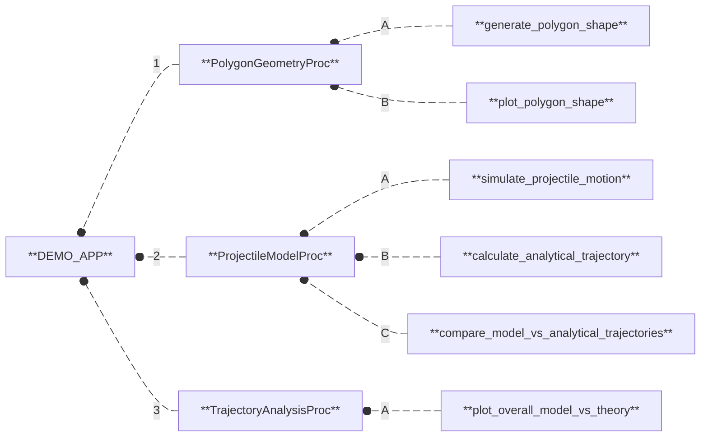
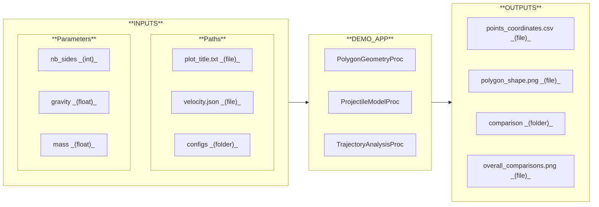
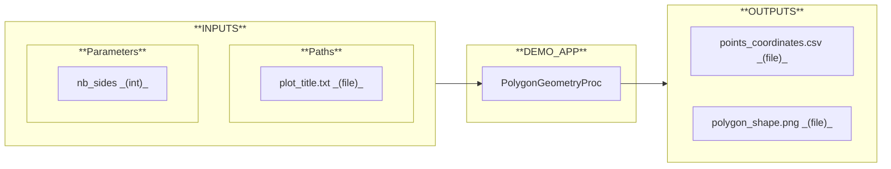
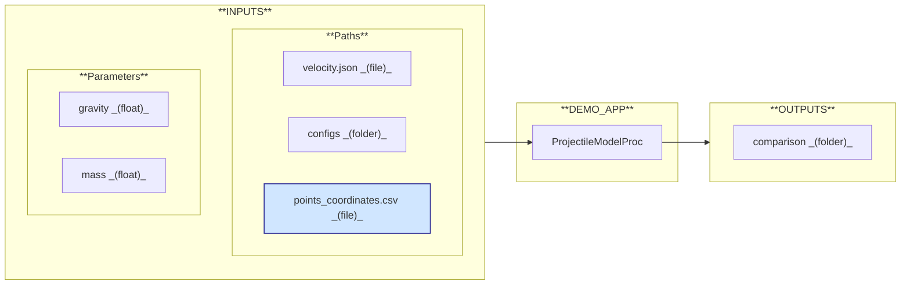
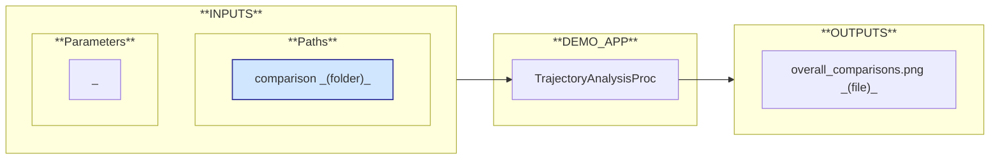

# Materials & Methods

This use case is operationalized through a sequential scientific workflow, implemented as a **nuRemics App** called **[`DEMO_APP`](../../../labs/apps/general/DEMO_APP.md){:target="_blank"}**.

## Workflow

The workflow is composed of the following software processes:

1. **[`PolygonGeometryProc`](../../../labs/procs/general/PolygonGeometryProc.md){:target="_blank"}:** Generate and plot a regular 2D polygon shape. 
  A/ **`generate_polygon_shape`:** Generate the 2D coordinates of a regular polygon. 
  B/ **`plot_polygon_shape`:** Plot a closed 2D polygon from a set of points.
2. **[`ProjectileModelProc`](../../../labs/procs/general/ProjectileModelProc.md){:target="_blank"}:** Simulate the motion of a projectile and compare its trajectory with the analytical solution. 
  A/ **`simulate_projectile_motion`:** Simulate the motion of a 2D rigid body under gravity projected with an initial velocity. 
  B/ **`calculate_analytical_trajectory`:** Calculate the theoretical trajectory of a projectile using analytical equations. 
  C/ **`compare_model_vs_analytical_trajectories`:** Plot and save the comparison between simulated (model) and theoretical projectile trajectories.
3. **[`TrajectoryAnalysisProc`](../../../labs/procs/general/TrajectoryAnalysisProc.md){:target="_blank"}:** Perform overall comparisons between simulated (model) and theoretical trajectories. 
  A/ **`plot_overall_model_vs_theory`:** Generate overall comparative plots of simulated (model) and theoritical trajectories.

## I/O Interface

The following I/O interface describes the input data required and the output data generated by the workflow:

The **[`PolygonGeometryProc`](../../../labs/procs/general/PolygonGeometryProc.md){:target="_blank"}** software process handles the following input and output data:

The **[`ProjectileModelProc`](../../../labs/procs/general/ProjectileModelProc.md){:target="_blank"}** software process handles the following input and output data:

The **[`TrajectoryAnalysisProc`](../../../labs/procs/general/TrajectoryAnalysisProc.md){:target="_blank"}** software process handles the following input and output data:

### Inputs

The input data are divided into two categories: **Parameters** and **Paths**.

#### Parameters

These are scalar values that must be defined to configure the workflow:

- **`nb_sides`:** Number of sides of the polygon.
- **`gravity`:** Gravitational acceleration $(m/s^2)$.
- **`mass`:** Mass of the body $(kg)$.

#### Paths

These are either files or folders that must be provided to configure the workflow:

- **`plot_title.txt`:** File containing the plot title of the 2D polygon shape.
- **`velocity.json`:** File containing the velocity initial conditions {$v_0$ $(m/s)$; $\alpha$ $(°)$}.
- **`configs/`**  
  **`solver_config.json`:** File containing the parameters for solver configuration.  
  **`display_config.json`:** File containing the parameters for display configuration.

### Outputs

The output data are either files or folders generated by the workflow and written to disk:

- **`points_coordinates.csv`:** File containing the X/Y coordinates of the polygon vertices.
- **`polygon_shape.png`:** Image of the plotted polygon figure.
- **`comparison/`**  
  **`results.xlsx`:** File containing simulated (model) and theoritical trajectories.  
  **`model_vs_theory.png`:** Image comparing both trajectories.
- **`overall_comparisons.png`:** Image containing overall comparative plots.

---

  <a href="../introduction/"
     class="md-button md-button--primary">
    Introduction
  </a>

---