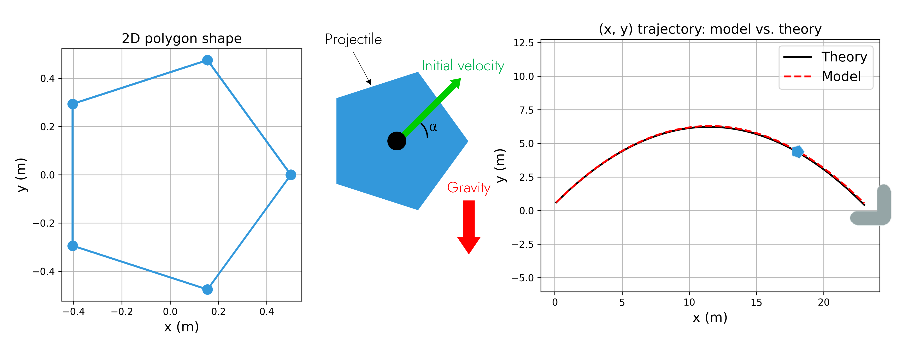
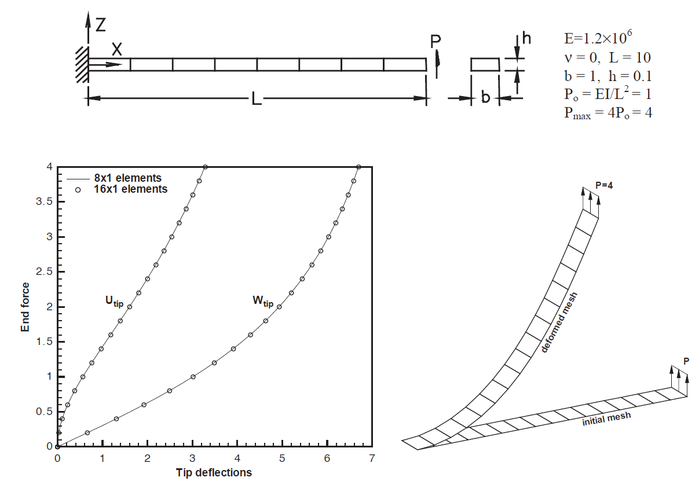

# Computational Modeling & Simulation (CM&S)

  <a href="cantilever-shear/app.html" target="_blank" rel="noopener noreferrer">
  Projectile motion under gravity
  </a>
  
Solid mechanics simulation of projectile kinematics launched with an initial velocity and subjected to gravitational acceleration.

  

  <a href="cantilever-shear/app.html" target="_blank" rel="noopener noreferrer">
  Cantilever subjected to end shear force
  </a>
  
Computational solid mechanics benchmark focusing on the non-linear response of a shear-loaded beam structure.

  

<!-- This topic focuses on the design and implementation of **nuRemics** components dedicated to Computational Modeling & Simulation (CM&S) workflows:

- **Geometry creation:** Build, import, or manipulate a geometric model — from basic primitive shapes to complex CAD (Computer-Aided Design) assemblies.
- **Physical labeling:** Translate a geometric model into physical model — label volumes, surfaces, edges, and vertices of interest, then assign physical entities, material properties, and boundary conditions.
- **Mesh generation:** Discretize a geometric model into mesh — generating nodes and elements (e.g., tetrahedra, hexahedra, triangles, etc.) that represent the shapes for numerical analysis.
- **Physical data mapping:** Transfer physical labels from a geometric model onto the associated mesh — ensuring the mesh nodes and elements carry out the necessary physical information.
- **Solver resolution:** Compute the numerical solution of a physical problem — applying appropriate numerical methods to solve constitutive equations on the mesh and simulate system behavior.
- **Post-processing & Visualization**: Extract and visualize raw simulation results — turning numerical outputs into interpretable visual formats like plots, maps, and animations.
- **Data Analysis & Interpretation**: Interpret and evaluate processed data — performing comparisons, derived calculations, and decision-making based on simulation outcomes.

---

Take part of the discussions on the Discord category <code>🛠️ Modeling & Simulation</code>

  <a href="https://www.suffisciens.com/labsvision"
     target="_blank"
     rel="noopener noreferrer"
     class="md-button md-button--primary">
    Start Your Onboarding
  </a>

---

-->